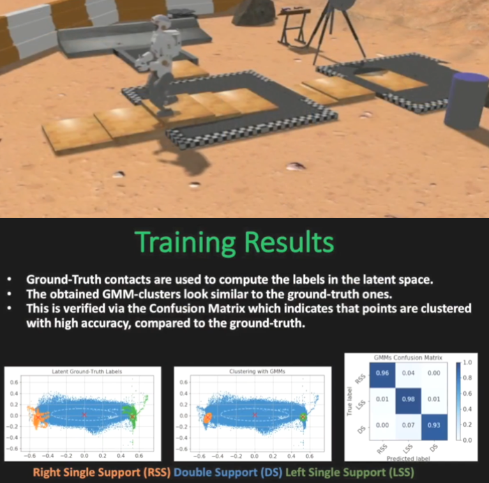
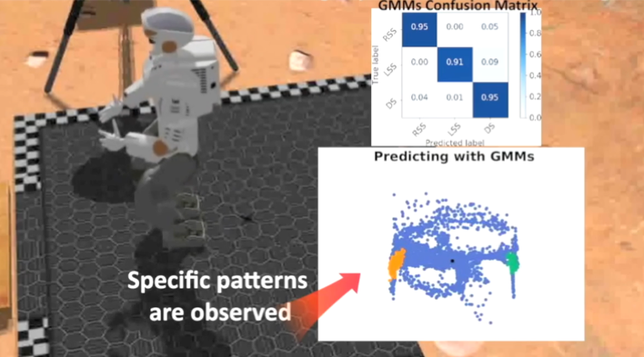

# gem
Gait-phase Estimation Module (GEM) for Humanoid Robot Walking. The code is open-source (BSD License). Please note that this work is an on-going research and thus some parts are not fully developed yet. Furthermore, the code will be subject to changes in the future which could include greater re-factoring.

GEM is an unsupervised learning framework which employs a 2D latent space and Gaussian Mixture Models (GMMs) to facilitate accurate prediction/classification of the gait phase during locomotion.

## Training
Solely prioproceptive sensing is utilized in training, namely:
* joint encoder
* F/T
* IMU

  

## Real-time Gait-Phase Prediction
GEM can be readily employed in real-time for estimating the gait phase. 

  

## Getting Started
These instructions will get you a copy of the project up and running on your local machine for development and testing purposes.

## Prerequisites
* Ubuntu 14.04 and later
* ROS indigo and later
* Sklearn 
* Keras 

## Installing
* pip install sklearn
* pip install keras
* git clone https://github.com/mrsp/gem.git
* catkin_make -DCMAKE_BUILD_TYPE=Release 
* If you are using catkin tools run: catkin build  --cmake-args -DCMAKE_BUILD_TYPE=Release 

## ROS Examples
### Train the Valkyrie module
* Download the valkyrie bag file from [valk_bagfile](http://users.ics.forth.gr/~spiperakis/gem_test_valkyrie.zip)
* Uncompress
* train: python train.py 

### Train your own module
* Save the corresponding files in a similar form as the valkyrie bag file from [valk_bagfile](http://users.ics.forth.gr/~spiperakis/gem_test_valkyrie.zip)
* train: python train.py

### Run in real-time to infer the gait-phase:
* configure appropriately the config yaml file (in config folder) with the corresponding topics 
* roslaunch gem gem_ros.launch
